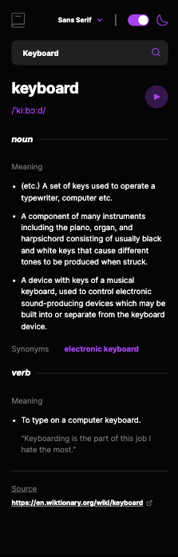

This is a [Next.js](https://nextjs.org) project bootstrapped with [`create-next-app`](https://nextjs.org/docs/app/api-reference/cli/create-next-app) and also the solution to the [Dictionary web app challenge on Frontend Mentor](https://www.frontendmentor.io/challenges/dictionary-web-app-h5wwnyuKFL).

## Table of contents

- [Overview](#overview)
  - [Getting Started](#getting-started)
  - [Screenshot](#screenshot)
  - [Links](#links)
- [My process](#my-process)
  - [Built with](#built-with)
  - [What I learned](#what-i-learned)
  - [Useful resources](#useful-resources)
- [Author](#author)
- [Learn More](#learn-more) 
- [Deploy on Vercel](#deploy-on-vercel)


## Overview

### Getting Started

First, run the development server:

```bash
npm run dev
```

Open [http://localhost:3000](http://localhost:3000) with your browser to see the result.

### Screenshot




### Links

- Solution URL: [Github Link](https://github.com/itadori-kun/dictionary-web-app-with-nextJs)
- Live Site URL: [Dictionary Page](https://dictionary-web-app-with-next-js-jbfj.vercel.app/)

## My process

### Built with

- Semantic HTML5 markup
- TailwindCss
- Mobile-first workflow
- [Next.js](https://nextjs.org/) - React framework

### What I learned

I learnt about flatMap and how it is chained to a new Set and also to an Array

```React
Array.from( new Set( inputValue.flatMap( output => output.sourceUrls ) ) ).map( ( url, j ) => ()
```


### Useful resources

- [Example resource 1](https://flowbite.com/docs/forms/input-field/) - This helped me with the input box. I really liked this pattern and will use it going forward and also makes things easier.

## Author

- Frontend Mentor - [@itadori-kun](https://www.frontendmentor.io/profile/itadori-kun)
- Twitter - [@godwincruise](https://www.twitter.com/godwincruise)


## Learn More

To learn more about Next.js, take a look at the following resources:

- [Next.js Documentation](https://nextjs.org/docs) - learn about Next.js features and API.
- [Learn Next.js](https://nextjs.org/learn) - an interactive Next.js tutorial.

You can check out [the Next.js GitHub repository](https://github.com/vercel/next.js) - your feedback and contributions are welcome!

## Deploy on Vercel

The easiest way to deploy your Next.js app is to use the [Vercel Platform](https://vercel.com/new?utm_medium=default-template&filter=next.js&utm_source=create-next-app&utm_campaign=create-next-app-readme) from the creators of Next.js.

Check out our [Next.js deployment documentation](https://nextjs.org/docs/app/building-your-application/deploying) for more details.
